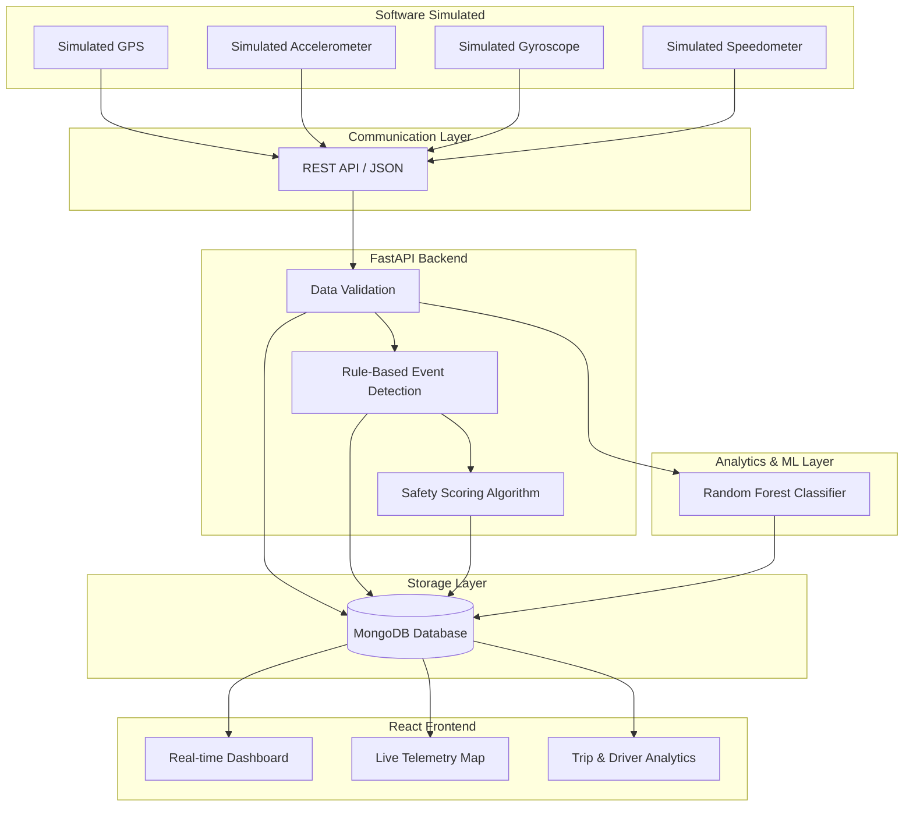

```mermaid
flowchart TD
    subgraph IoT Sensor Layer [Software Simulated]
        GPS[Simulated GPS]
        Accel[Simulated Accelerometer]
        Gyro[Simulated Gyroscope]
        Speed[Simulated Speedometer]
    end

    subgraph Communication Layer
        REST[REST API / JSON]
    end

    subgraph Processing Layer [FastAPI Backend]
        Validation[Data Validation]
        EventDetection[Rule-Based Event Detection]
        Scoring[Safety Scoring Algorithm]
    end

    subgraph Analytics & ML Layer
        MLModel[Random Forest Classifier]
    end

    subgraph Storage Layer
        MongoDB[(MongoDB Database)]
    end

    subgraph Application Layer [React Frontend]
        Dashboard[Real-time Dashboard]
        LiveMap[Live Telemetry Map]
        TripAnalytics[Trip & Driver Analytics]
    end

    GPS --> REST
    Accel --> REST
    Gyro --> REST
    Speed --> REST

    REST --> Validation
    Validation --> EventDetection
    EventDetection --> Scoring
    Validation --> MLModel

    Validation --> MongoDB
    EventDetection --> MongoDB
    Scoring --> MongoDB
    MLModel --> MongoDB

    MongoDB --> Dashboard
    MongoDB --> LiveMap
    MongoDB --> TripAnalytics
```
